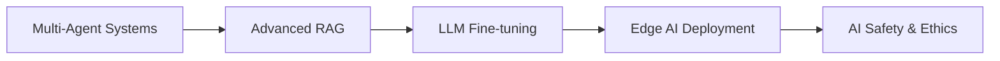

# 🚀 AI Engineer | Building Tomorrow's Intelligence Today

```ascii
╔══════════════════════════════════════════════════════════════╗
║  "Transforming complex problems into intelligent solutions"  ║
╚══════════════════════════════════════════════════════════════╝
```

## 👨‍💻 About Me

Currently architecting the future of AI at **Siemens** in Bangalore, where I bridge the gap between cutting-edge research and real-world industrial applications. With a strong foundation in Computer Science from **NIT Meghalaya**, I'm passionate about pushing the boundaries of artificial intelligence.

```python
class AIEngineer:
    def __init__(self):
        self.name = "Your Name"
        self.role = "AI Engineer @ Siemens"
        self.location = "Bangalore, India 🇮🇳"
        self.education = "B.Tech CSE - NIT Meghalaya"
        self.passion = ["GenAI", "LLMs", "Multi-Agent Systems"]
        
    def current_focus(self):
        return [
            "🧠 Generative AI Applications",
            "🤖 Large Language Model Engineering", 
            "🔄 Multi-Agentic System Architecture",
            "⚙️ Industrial AI Solutions"
        ]
        
    def daily_routine(self):
        return "Build → Test → Deploy → Innovate → Repeat"
```

## 🎯 What I'm Working On

**🔬 Research & Development**
- Exploring novel architectures for multi-agent collaboration
- Optimizing LLM performance for industrial use cases
- Developing AI solutions that scale across enterprise environments

**💡 Innovation Focus**
- Bridging the gap between academic research and production systems
- Creating AI tools that enhance human productivity
- Building robust, reliable AI systems for critical applications

## 🛠️ Tech Arsenal

**AI/ML Stack**
```
🧮 Frameworks: PyTorch, TensorFlow, Transformers, LangChain
🔧 MLOps: MLflow, Kubeflow, Docker, Kubernetes  
☁️ Cloud: AWS, Azure, GCP
💾 Databases: Vector DBs, PostgreSQL, MongoDB
🔗 APIs: OpenAI, Anthropic, Hugging Face
```

**Core Technologies**
```
🐍 Python | ☕ Java | 🌐 JavaScript | 🦀 Rust
📊 Data Science | 🏗️ System Design | 🔄 DevOps
```

## 📈 Current Learning Path



## 🌟 Philosophy

> *"The best AI systems are those that amplify human intelligence rather than replace it."*

I believe in building AI that:
- 🤝 Enhances human capabilities
- 🔒 Prioritizes safety and ethics
- 🌍 Solves real-world problems
- 📈 Scales responsibly

## 🏆 Recent Achievements

- 🎯 Successfully deployed multi-agent systems in production at Siemens
- 🚀 Contributed to open-source AI/ML projects
- 📝 Published research on industrial AI applications
- 🗣️ Speaker at local AI meetups and conferences

## 💬 Let's Connect

Always excited to discuss AI, collaborate on interesting projects, or share insights about the future of technology!

**💼 Professional**: [LinkedIn](https://linkedin.com/in/yourprofile)  
**🐦 Thoughts**: [Twitter](https://twitter.com/yourhandle)  
**✉️ Email**: your.email@domain.com

---

```
⚡ "Code is poetry, AI is the future, and together they create magic." ⚡
```

**📊 GitHub Stats**


**🔥 Contribution Streak**


**💻 Most Used Languages**


---

*⭐ From [yourusername](https://github.com/yourusername) - Building the future, one algorithm at a time.*
